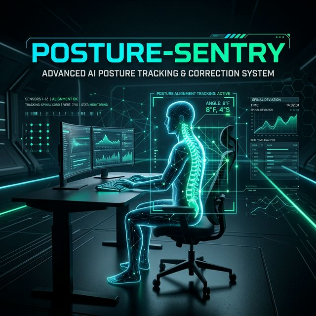
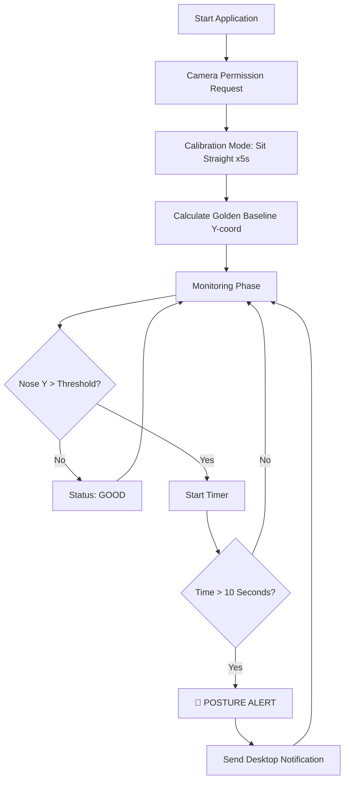

# 🛡️ POSTURE-SENTRY

<p align="center">
  
</p>


I was struggling with chronic back pain due to long office hours and sitting in front of the screen all the time. My posture was deteriorating, and I realized I needed a way to stay mindful of my spine health without manual tracking. That’s why I decided to create **Posture Sentry** with **Vibe Coding**—to bring health and alignment back to my workspace and manage my posture effectively.

---

## 📸 Overview

Posture Sentry works by calibrating a "Golden Baseline" based on your ideal sitting position. It then continuously monitors your nose position relative to this baseline. If you slouch for more than 10 seconds, it sends a desktop notification to nudge you back into place.

### Key Features
- **🎯 Accurate Calibration**: Sets an average baseline for your nose position.
- **🕒 Timing-aware Alerts**: Notifications are only triggered if poor posture is sustained (avoiding false alarms for momentary movement).
- **🖥️ Foreground/Background Modes**: Run it as a visible window or as a silent background process.
- **🔒 Privacy First**: All video processing happens locally on your machine. No data is stored or transmitted.
- **🔔 Desktop Notifications**: Integrated alerts using `notify-send`.

---

## 📊 How It Works (Diagram)



---

## 🚀 Installation

### 1. Clone the repository
```bash
git clone https://github.com/your-username/posture-sentry.git
cd posture-sentry
```

### 2. Set up a virtual environment (Recommended)
```bash
python -m venv .venv
source .venv/bin/activate  # Linux/Mac
```

### 3. Install dependencies
```bash
pip install -r requirements.txt
```

### 4. Download the MediaPipe Model
Ensure you have the `pose_landmarker.task` file in the project root. You can download it from [MediaPipe's official site](https://storage.googleapis.com/mediapipe-models/pose_landmarker/pose_landmarker_heavy/float16/1/pose_landmarker_heavy.task) and rename it to `pose_landmarker.task`.

---

## 🛠️ Usage

Simply run the main script:

```bash
python app.py
```

### Steps:
1.  **Permission**: Grant camera access when prompted.
2.  **Calibration**: Sit in your ideal posture for 5 seconds.
3.  **Mode selection**: Choose between:
    *   `1`: Foreground (with camera window)
    *   `2`: Background (silent monitoring)
4.  **Monitor**: Stay productive while Posture Sentry watches your back!

---

## 📦 Requirements

- Python 3.8+
- OpenCV
- MediaPipe
- `libnotify-bin` (for Linux notifications)

---

## 🤝 Contributing

Contributions are welcome! Feel free to open an issue or submit a pull request.

## 📄 License

MIT License. See `LICENSE` for details (if any).
